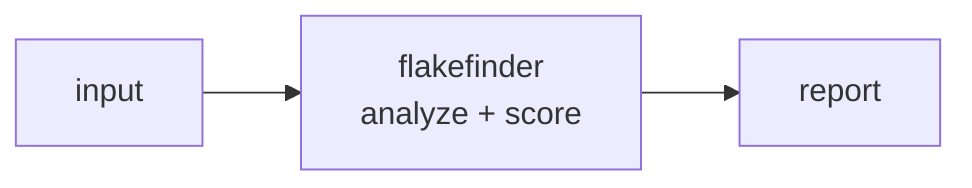

<a name="top"></a>
<div align="center">


# FLAKEFINDER

### Flaky-test detector from CI history with quarantine suggestions


[](https://pypi.org/project/cognis-flakefinder/) [](https://github.com/cognis-digital/flakefinder/actions) [](LICENSE) [](https://github.com/cognis-digital)

*Developer Tools — fast, single-purpose, CI- and agent-friendly.*

</div>

```bash
pip install cognis-flakefinder
flakefinder scan .            # → prioritized findings in seconds
```

## Usage — step by step

1. **Install** the CLI:

   ```bash
   pipx install "git+https://github.com/cognis-digital/flakefinder.git"
   ```

2. **Analyze** a CI-history file (`.json`, `.jsonl`, or `.csv` of test runs). This is the primary command:

   ```bash
   flakefinder analyze ci-history.jsonl
   ```

3. **Tune the gate** — only quarantine tests at/above a flakiness score, and require a minimum number of runs before scoring:

   ```bash
   flakefinder analyze ci-history.jsonl --threshold 60 --min-runs 5
   ```

4. **Read the output** — `flakefinder` exits `0` when no flaky tests are found and `2` when flaky tests are detected (so it can fail a pipeline). Emit JSON for machines, or just the quarantine list:

   ```bash
   flakefinder analyze ci-history.jsonl --format json > flaky.json
   flakefinder quarantine ci-history.jsonl > quarantine.txt   # one test id per line
   ```

5. **Wire into CI** — let the exit code gate the build:

   ```yaml
   - run: flakefinder analyze artifacts/ci-history.jsonl --threshold 50
     # exit 2 => flaky tests detected => job fails
   ```

## Contents

- [Why flakefinder?](#why) · [Features](#features) · [Quick start](#quick-start) · [Example](#example) · [Architecture](#architecture) · [AI stack](#ai-stack) · [How it compares](#how-it-compares) · [Integrations](#integrations) · [Install anywhere](#install-anywhere) · [Related](#related) · [Contributing](#contributing)

<a name="why"></a>
## Why flakefinder?

universal test pain

`flakefinder` is single-purpose, scriptable, and self-hostable: point it at a target, get prioritized results in the format your workflow already speaks (table · JSON · SARIF), gate CI on it, and let agents drive it over MCP.

<div align="right"><a href="#top">↑ back to top</a></div>

<a name="features"></a>
## Features

- ✅ Load Runs
- ✅ Flakiness Score
- ✅ Analyze
- ✅ Runs on Linux/macOS/Windows · Docker · devcontainer
- ✅ Ports in Python, JavaScript, Go, and Rust (`ports/`)

<div align="right"><a href="#top">↑ back to top</a></div>

<a name="quick-start"></a>
## Quick start

```bash
pip install cognis-flakefinder
flakefinder --version
flakefinder scan .                       # scan current project
flakefinder scan . --format json         # machine-readable
flakefinder scan . --fail-on high        # CI gate (non-zero exit)
```

<div align="right"><a href="#top">↑ back to top</a></div>

<a name="example"></a>
## Example

```text
$ flakefinder scan .
  [HIGH    ] FLA-001  example finding             (./src/app.py)
  [MEDIUM  ] FLA-002  another signal              (./config.yaml)

  2 findings · risk score 5 · 38ms
```

<div align="right"><a href="#top">↑ back to top</a></div>

<a name="architecture"></a>
## Architecture



<div align="right"><a href="#top">↑ back to top</a></div>

<a name="ai-stack"></a>
## Use it from any AI stack

`flakefinder` is interoperable with every popular way of using AI:

- **MCP server** — `flakefinder mcp` (Claude Desktop, Cursor, Cognis.Studio, [uncensored-fleet](https://github.com/cognis-digital/uncensored-fleet))
- **OpenAI-compatible / JSON** — pipe `flakefinder scan . --format json` into any agent or LLM
- **LangChain · CrewAI · AutoGen · LlamaIndex** — wrap the CLI/JSON as a tool in one line
- **CI / scripts** — exit codes + SARIF for non-AI pipelines

<div align="right"><a href="#top">↑ back to top</a></div>

<a name="how-it-compares"></a>
## How it compares

| | **Cognis flakefinder** | BuildPulse |
|---|:---:|:---:|
| Self-hostable, no account | ✅ | varies |
| Single command, zero config | ✅ | ⚠️ |
| JSON + SARIF for CI | ✅ | varies |
| MCP-native (AI agents) | ✅ | ❌ |
| Polyglot ports (JS/Go/Rust) | ✅ | ❌ |
| Open license | ✅ COCL | varies |

*Built in the spirit of **BuildPulse**, re-framed the Cognis way. Missing a credit? Open a PR.*

<div align="right"><a href="#top">↑ back to top</a></div>

<a name="integrations"></a>
## Integrations

Pipes into your stack: **SARIF** for code-scanning, **JSON** for anything, an **MCP server** (`flakefinder mcp`) for AI agents, and a webhook forwarder for SIEM/Slack/Jira. See [`docs/INTEGRATIONS.md`](docs/INTEGRATIONS.md).

<div align="right"><a href="#top">↑ back to top</a></div>

<a name="install-anywhere"></a>
## Install — every way, every platform

```bash
pip install "git+https://github.com/cognis-digital/flakefinder.git"    # pip (works today)
pipx install "git+https://github.com/cognis-digital/flakefinder.git"   # isolated CLI
uv tool install "git+https://github.com/cognis-digital/flakefinder.git" # uv
pip install cognis-flakefinder                                          # PyPI (when published)
docker run --rm ghcr.io/cognis-digital/flakefinder:latest --help        # Docker
brew install cognis-digital/tap/flakefinder                             # Homebrew tap
curl -fsSL https://raw.githubusercontent.com/cognis-digital/flakefinder/main/install.sh | sh
```

| Linux | macOS | Windows | Docker | Cloud |
|---|---|---|---|---|
| `scripts/setup-linux.sh` | `scripts/setup-macos.sh` | `scripts/setup-windows.ps1` | `docker run ghcr.io/cognis-digital/flakefinder` | [DEPLOY.md](docs/DEPLOY.md) (AWS/Azure/GCP/k8s) |

<div align="right"><a href="#top">↑ back to top</a></div>

<a name="related"></a>
## Related Cognis tools

- [`mcpforge`](https://github.com/cognis-digital/mcpforge) — Scaffold, test, and publish MCP servers in minutes
- [`promptlint`](https://github.com/cognis-digital/promptlint) — Lint, version, and test prompts as code with a CI gate
- [`envdoctor`](https://github.com/cognis-digital/envdoctor) — .env validator, secret-presence and config-drift checker
- [`apidiff`](https://github.com/cognis-digital/apidiff) — Breaking-change detector for OpenAPI / GraphQL across commits
- [`codeglance`](https://github.com/cognis-digital/codeglance) — Repo onboarding map — architecture + hotspots for humans and agents
- [`licenselens`](https://github.com/cognis-digital/licenselens) — Dependency license + SBOM gate, developer-CLI first

**Explore the suite →** [🗂️ all 170+ tools](https://github.com/cognis-digital/cognis-neural-suite) · [⭐ awesome-cognis](https://github.com/cognis-digital/awesome-cognis) · [🔗 cognis-sources](https://github.com/cognis-digital/cognis-sources) · [🤖 uncensored-fleet](https://github.com/cognis-digital/uncensored-fleet) · [🧠 engram](https://github.com/cognis-digital/engram)

<div align="right"><a href="#top">↑ back to top</a></div>

<a name="contributing"></a>
## Contributing

PRs, new rules, and demo scenarios are welcome under the collaboration-pull model — see [CONTRIBUTING.md](CONTRIBUTING.md) and [SECURITY.md](SECURITY.md).

> ### ⭐ If `flakefinder` saved you time, **star it** — it genuinely helps others find it.

## Interoperability

`{}` composes with the 300+ tool Cognis suite — JSON in/out and a shared
OpenAI-compatible `/v1` backbone. See **[INTEROP.md](INTEROP.md)** for the
suite map, composition patterns, and reference stacks.

## License

Source-available under the **Cognis Open Collaboration License (COCL) v1.0** — free for personal, internal-evaluation, research, and educational use; **commercial / production use requires a license** (licensing@cognis.digital). See [LICENSE](LICENSE).

---

<div align="center"><sub><b><a href="https://cognis.digital">Cognis Digital</a></b> · one of 170+ tools in the <a href="https://github.com/cognis-digital/cognis-neural-suite">Cognis Neural Suite</a> · <i>Making Tomorrow Better Today</i></sub></div>
